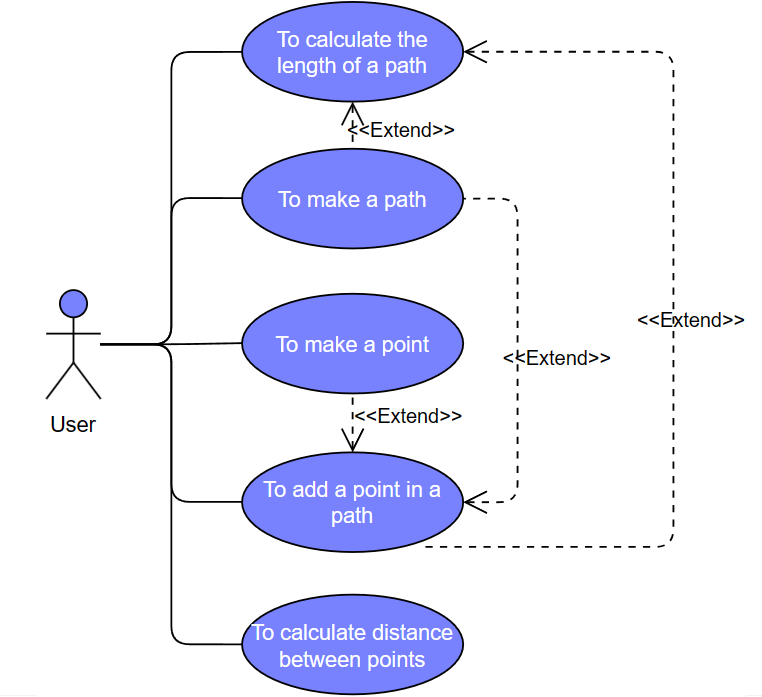
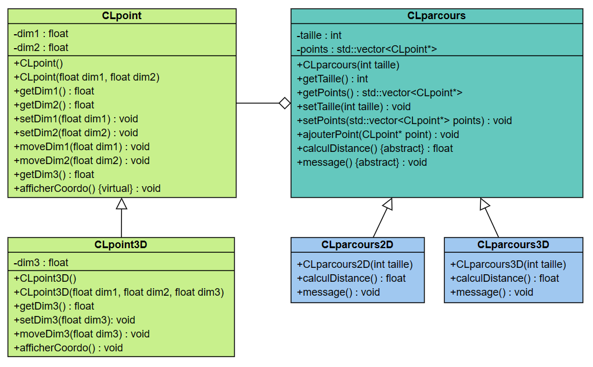
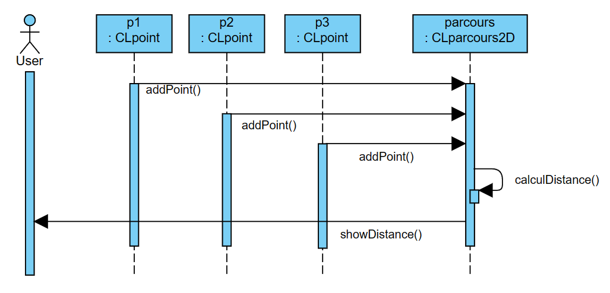

# Program to calculate the length of a path
## Table of contents
- Introduction
- Use case diagram
- Class diagram
- Sequence diagram
## Introduction
The goal of this program is to calculate the length of a path composed by 2D or 3D points.
## Use case diagram

## Class diagram

## Sequence diagram

